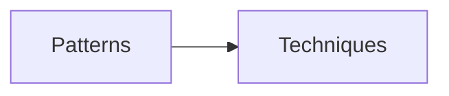

# javascript-gof-patterns
Implementation patterns and advanced techniques

## Patterns																				
- [x]  Фабричный метод (Factory Method)
- [x]  Абстрактная фабрика (Abstract Factory)
- [x]  Строитель (Builder)
- [x]  Прототип (Prototype)
- [x]  Одиночка (Singleton)
- [x]  Адаптер (Adapter)
- [x]  Мост (Bridge)
- [x]  Компоновщик (Composite)
- [x]  Декоратор (Decorator)
- [x]  Фасад (Facade)
- [x]  Легковес (Flyweight)
- [x]  Заместитель (Proxy)
- [x]  Цепочка обязанностей (Chain of Responsibility)
- [x]  Команда (Command)
- [x]  Итератор (Iterator)
- [x]  Посредник (Mediator)
- [x]  Снимок (Memento)
- [x]  Наблюдатель (Observer)
- [x]  Состояние (State)
- [x]  Стратегия (Strategy)
- [x]  Шаблонный метод (Template Method)
- [x]  Посетитель (Visitor)

## Techniques
- [x]  debounce
- [x]  throttle
- [x]  memoize
- [x]  partial
- [x]  curry
- [x]  chaining
- [x]  pipe

## SOLID
- [ ] Single Responsibility Principle (Принцип единственной ответственности).
- [ ] Open-Closed Principle (Принцип открытости-закрытости).
- [ ] Liskov Substitution Principle (Принцип подстановки Барбары Лисков).
- [ ] Interface Segregation Principle (Принцип разделения интерфейса).
- [ ] Inversion Principle (Принцип инверсии зависимостей).

## OOP
- [ ] Abstraction (Абстракция) 
- [ ] Polymorphism (Полиморфизм)
- [x] Inheritance (Наследование)  
- [x] Encapsulation (Инкапсуляция) 