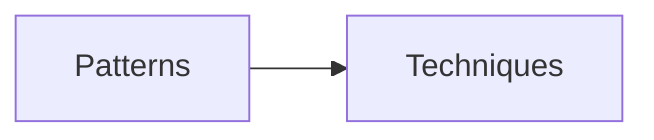

# javascript-gof-patterns
Implementation patterns and advanced techniques

## Patterns																				
- [ ]  Фабричный метод
- [ ]  Абстрактная фабрика
- [ ]  Строитель
- [ ]  Прототип
- [x]  Одиночка
- [ ]  Адаптер
- [ ]  Мост
- [ ]  Компоновщик
- [ ]  Декоратор
- [ ]  Фасад
- [ ]  Легковес
- [ ]  Заместитель
- [ ]  Цепочка обязанностей
- [ ]  Команда
- [ ]  Итератор
- [ ]  Посредник
- [ ]  Снимок
- [ ]  Наблюдатель
- [ ]  Состояние
- [ ]  Стратегия
- [ ]  Шаблонный метод
- [ ]  Посетитель

## Techniques
- [x]  debounce
- [x]  throttle
- [x]  memoize
- [x]  partial
- [x]  curry
- [ ]  chaining
- [ ]  pipe
