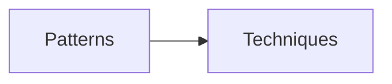

# javascript-gof-patterns
Implementation patterns and advanced techniques

## Patterns																				
- [x]  Фабричный метод (Factory Method)
- [x]  Абстрактная фабрика (Abstract Factory)
- [ ]  Строитель (Builder)
- [x]  Прототип (Prototype)
- [x]  Одиночка (Singleton)
- [ ]  Адаптер (Adapter)
- [ ]  Мост (Bridge)
- [ ]  Компоновщик (Composite)
- [ ]  Декоратор (Decorator)
- [ ]  Фасад (Facade)
- [x]  Легковес (Flyweight)
- [ ]  Заместитель (Proxy)
- [ ]  Цепочка обязанностей (Chain of Responsibility)
- [x]  Команда (Command)
- [ ]  Итератор (Iterator)
- [x]  Посредник (Mediator)
- [ ]  Снимок (Memento)
- [x]  Наблюдатель (Observer)
- [ ]  Состояние (State)
- [ ]  Стратегия (Strategy)
- [ ]  Шаблонный метод (Template Method)
- [ ]  Посетитель (Visitor)

## Techniques
- [x]  debounce
- [x]  throttle
- [x]  memoize
- [x]  partial
- [x]  curry
- [x]  chaining
- [x]  pipe

## SOLID
- [ ] Single Responsibility Principle (Принцип единственной ответственности).
- [ ] Open-Closed Principle (Принцип открытости-закрытости).
- [ ] Liskov Substitution Principle (Принцип подстановки Барбары Лисков).
- [ ] Interface Segregation Principle (Принцип разделения интерфейса).
- [ ] Inversion Principle (Принцип инверсии зависимостей).